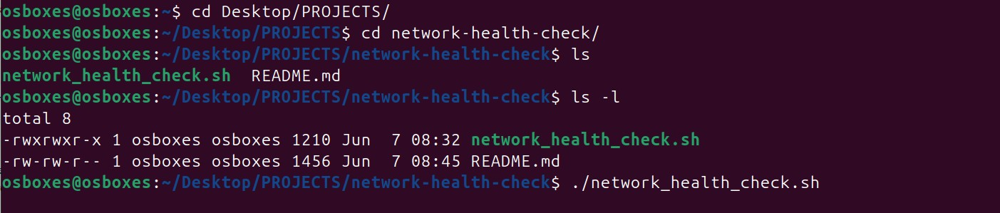
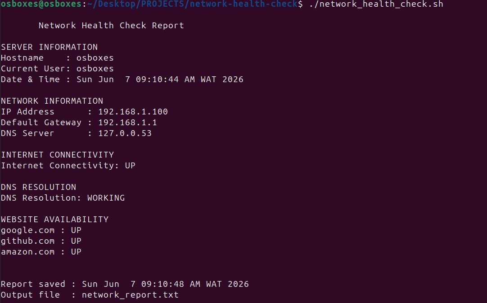
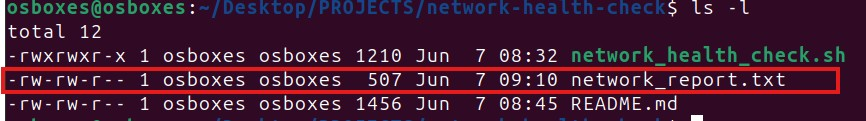
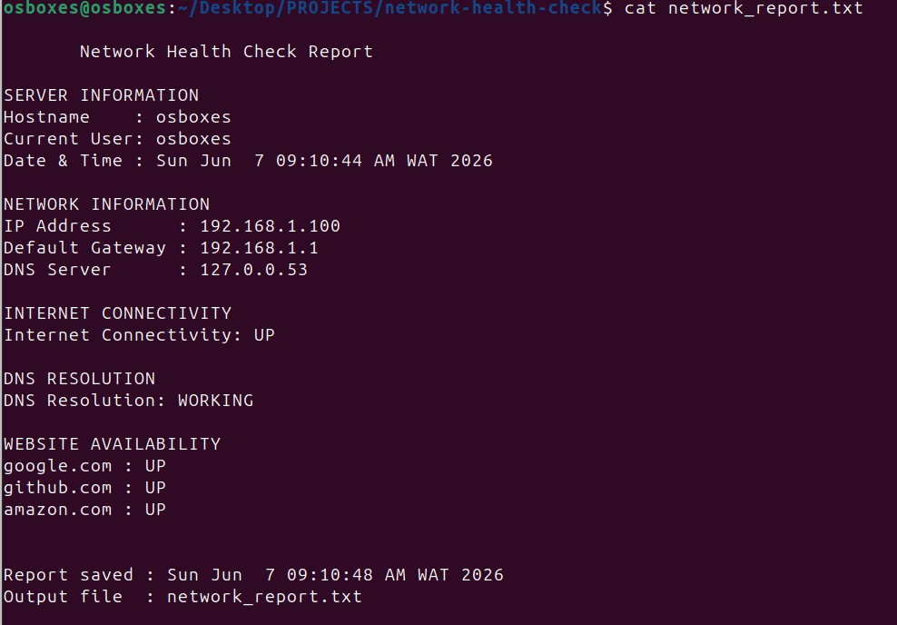

# Network Health Check

A Bash script that checks a server's network connectivity and saves the results into a report file.

---

## What It Does

The script runs through a set of network checks in sequence and writes everything to both the terminal and a file called `network_report.txt`. Each run overwrites the previous report so the output is always current.

Checks covered:

1. Server details: hostname, logged in user, date and time
2. Network details: IP address, default gateway, DNS server
3. Internet connectivity test via ping to `8.8.8.8`
4. DNS resolution test for `google.com`
5. Website availability test for `google.com`, `github.com`, and `amazon.com`

---

## Prerequisites

The following tools need to be present on the system:

| Tool | Purpose |
|------|---------|
| `bash` | Script runtime |
| `ping` | Internet connectivity check |
| `curl` | Website availability check |
| `nslookup` | DNS resolution check |
| `ip` | Gateway and routing info |

On Ubuntu or any Debian based system, install any missing tools with:

```bash
sudo apt install dnsutils curl -y
```

---

## Setup and Usage

**Clone the repository**

```bash
git clone https://github.com/Joel2kc/network-health-check.git
cd network-health-check
```

**Make the script executable**

```bash
chmod +x network_health_check.sh
```

**Run it**

```bash
./network_health_check.sh
```

**Read the generated report**

```bash
cat network_report.txt
```

---

## Sample Output

### Script Execution


### Report Output Display


### Report Created


### Report File Output
